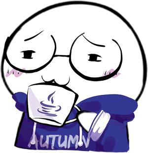

# Autumn
> 我为什么要用 Spring？

(Illustration by **LS**)

## 项目目的
抛开 Spring 巨轮，自己编写一个应用于小型项目的轻量级 Java 应用开发框架，以达到学(zhuang)习(bi)的目的。

## 子项目列表
| 子项目 | 状态 | 简介 |
| --- | --- | --- |
| [AutumnCore](autumn-core/) | 能用 | IoC 容器 / 依赖注入 |
| [AutumnHTTP](autumn-http/) | 能用 | HTTP 服务器 / 客户端组件 |
| [TomPuss](tompuss/) | 能用 | Web 服务器 / Servlet 容器 |
| [AutumnREST](autumn-rest/) | 能用 | MVC 风格的 RESTful 服务框架 |
| [AutumnRPC](autumn-rpc/) | 能用 | 跨语言(将来)的 HTTP RPC 框架 |
| [AutumnAOP](autumn-aop/) | 能用 | AOP 框架 |
| [Autumn-Integration-MyBatis](autumn-integration/autumn-integration-mybatis/) | 计划中 | 整合 MyBatis 框架 |
| Autumn-Integration-Hibernate | 计划中 | 整合 Hibernate 框架 |

## License
Copyright 2017 DeepAQ

Licensed under the Apache License, Version 2.0 (the "License");
you may not use this file except in compliance with the License.
You may obtain a copy of the License at

http://www.apache.org/licenses/LICENSE-2.0

Unless required by applicable law or agreed to in writing, software
distributed under the License is distributed on an "AS IS" BASIS,
WITHOUT WARRANTIES OR CONDITIONS OF ANY KIND, either express or implied.
See the License for the specific language governing permissions and
limitations under the License.